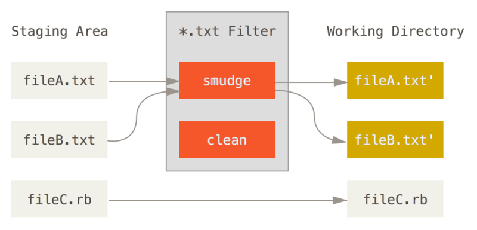
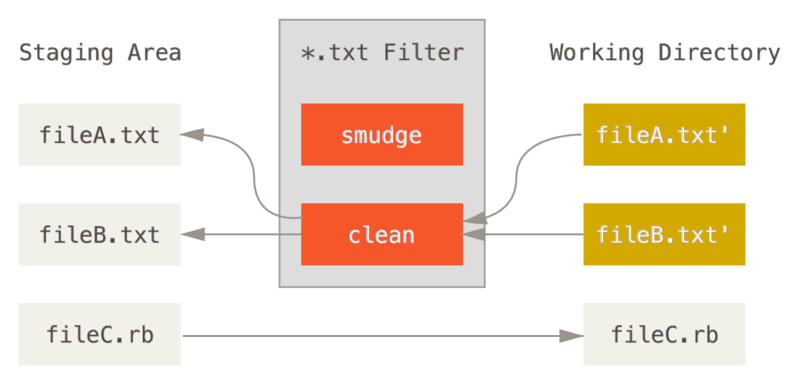

# gitattrs

Example, using git `clean` and `smudge` filters

When going from staging to working directory, the clean and smudge filters would be activated against the files mentioned in the filter (in the .gitattributes file)

Run the following, to add the commands
```bash
git config --local filter.updateApiKey.smudge 'sed "s/{SECURE_API_KEY}/fd716224-2881-4262-952f-7802a13ea50a/"'
git config --local filter.updateApiKey.clean 'sed "s/fd716224-2881-4262-952f-7802a13ea50a/{SECURE_API_KEY}/"'
```


<br />

---

<br />

### Git Smudge



<br />

---

<br />


### Git Clean



## References
https://git-scm.com/book/en/v2/Customizing-Git-Git-Attributes#_keyword_expansion
